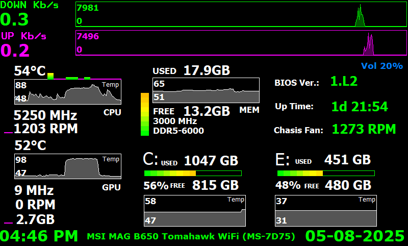
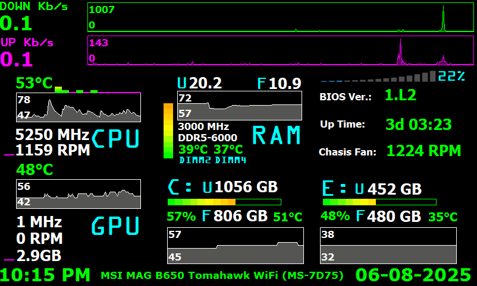
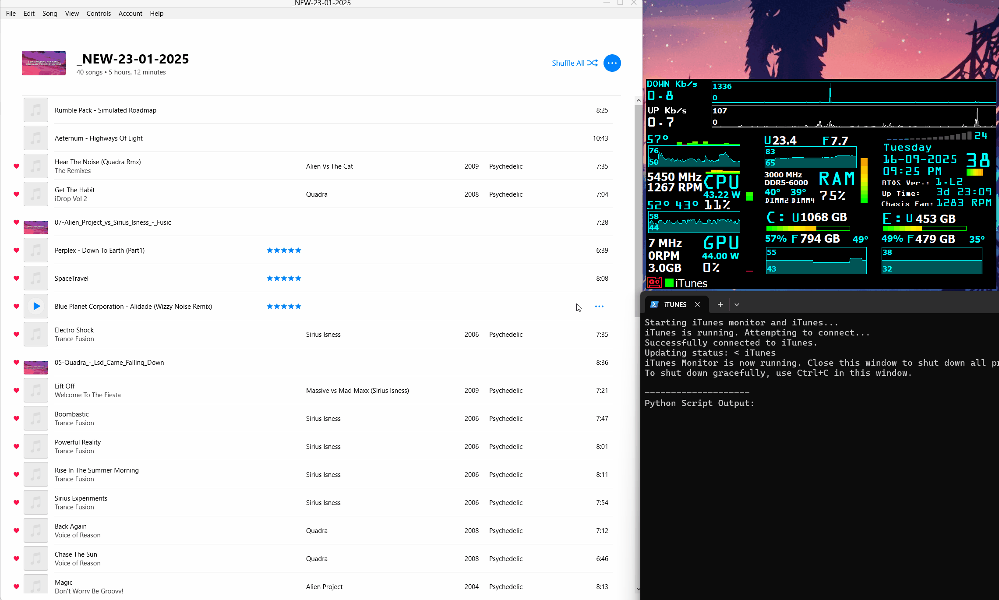
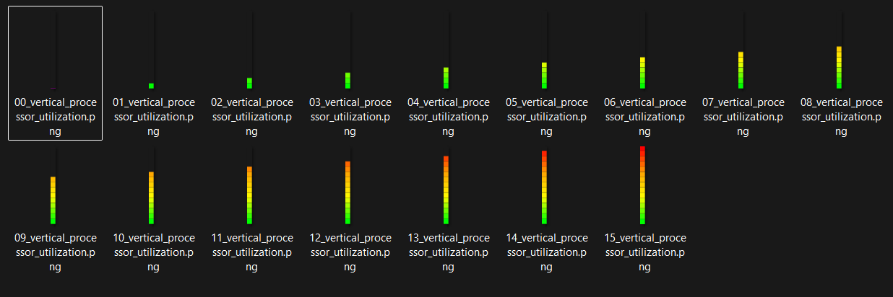
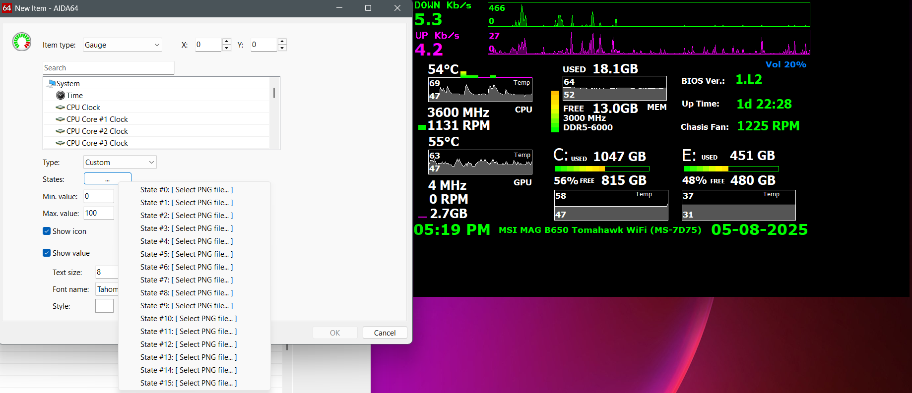
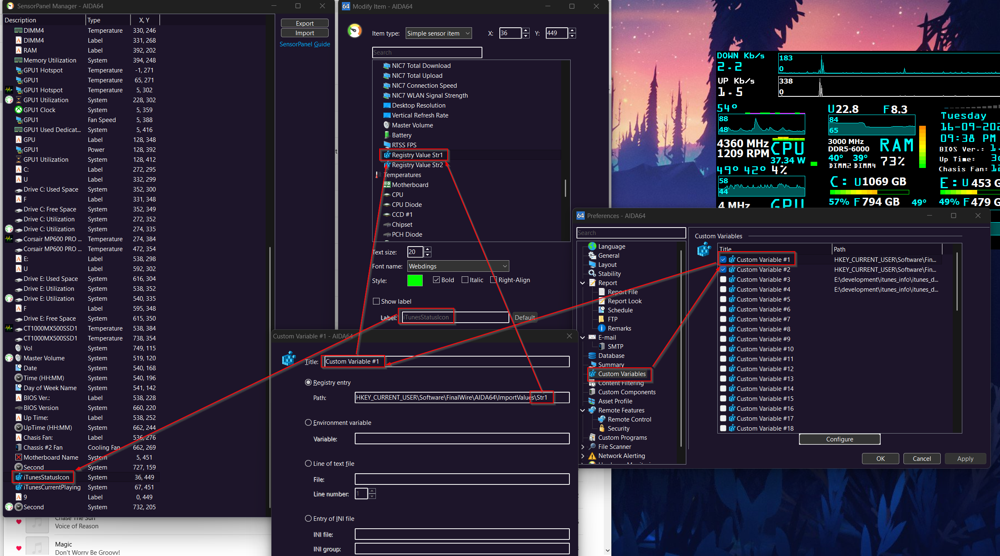

```javascript          
                    _    ___ ____    _    __   _  _     ____   ____  ____ 
                   / \  |_ _|  _ \  / \  / /_ | || |   | __ ) / ___|/ ___|
                  / _ \  | || | | |/ _ \| '_ \| || |_  |  _ \| |  _| |  _ 
                 / ___ \ | || |_| / ___ | (_) |__   _| | |_) | |_| | |_| |
                /_/   \_|___|____/_/   \_\___/   |_|   |____/ \____|\____|
                                                                    s-raza                                          
```

# AIDA64 Bar Gauge Generator

Generate 16‑frame (0–15) progression bar images for AIDA64 SensorPanel automatically no manual pixel pushing, no Photoshop sessions, no tears.

---

## Preview


<ins>**800x480-simple-panel-with-bars.sensorpanel**</ins>



<ins>**800x480-simple-panel-with-bars.spzip**</ins>



<ins>**800x480-panel-with-iTunes.spzip**</ins>

---

## Features

- 16 correctly indexed frames (levels 0–15) ready for AIDA64 custom gauge slots.
- Horizontal or vertical bar generation.
- Automatic scaling from a “base” design to your target screen resolution.
- Adjustable: bar count, height, total gauge width, spacing, outline & baseline styling, colors, background, file prefix, extension, output directory.
- Deterministic filenames for easy pairing inside AIDA64.
- Optional iTunes “Now Playing” integration (Windows + AIDA64 Business only).

## Why?

AIDA64's SensorPanel expects you to supply 16 images representing incremental fill states (0–15). Making them by hand is repetitive, error‑prone, and honestly: boring. This tool renders the full set programmatically consistent spacing, sizing, and alignment every time.

## How It Works (Quick Concept)

1. You specify a logical “base” screen size + gauge metrics (height, width, spacing).
2. You also give the target screen size you’re designing for.
3. The script scales dimensions proportionally so the gauge feels visually balanced on the actual panel resolution.
4. It renders each fill level into its own image file.

## Quick Start

```bash
git clone https://github.com/s-raza/aida64-bar-gauge-generator.git
cd aida64-bar-gauge-generator/
python -m venv .venv
source .venv/bin/activate
pip install -r requirements.txt
python -m aida64-bar-gauge-generator --vertical --file_prefix "processor_utilization" \
  --target_screen_width 1024 --target_screen_height 768 \
  --base_bar_height 20 --base_total_gauge_width 250
```

Output example:
```
✅ Done! 16 bar images saved to: 'output/vertical_processor_utilization_20x250'
```

## CLI Usage

View full help:

```bash
python -m aida64-bar-gauge-generator --help
```

Help output (verbatim):

```text
usage: __main__.py [-h] [--base_screen_width BASE_SCREEN_WIDTH] [--base_screen_height BASE_SCREEN_HEIGHT]
                   [--target_screen_width TARGET_SCREEN_WIDTH] [--target_screen_height TARGET_SCREEN_HEIGHT]
                   [--base_total_gauge_width BASE_TOTAL_GAUGE_WIDTH] [--base_bar_height BASE_BAR_HEIGHT] [--base_bar_spacing BASE_BAR_SPACING]
                   [--bar_count BAR_COUNT] [--outline_width OUTLINE_WIDTH] [--vertical] [--base_line_color BASE_LINE_COLOR]
                   [--base_line_thickness BASE_LINE_THICKNESS] [--background BACKGROUND] [--outline_color OUTLINE_COLOR]
                   [--file_prefix FILE_PREFIX] [--output_dir OUTPUT_DIR] [--file_ext FILE_EXT]

options:
  -h, --help            show this help message and exit
  --base_screen_width BASE_SCREEN_WIDTH
  --base_screen_height BASE_SCREEN_HEIGHT
  --target_screen_width TARGET_SCREEN_WIDTH
  --target_screen_height TARGET_SCREEN_HEIGHT
  --base_total_gauge_width BASE_TOTAL_GAUGE_WIDTH
  --base_bar_height BASE_BAR_HEIGHT
  --base_bar_spacing BASE_BAR_SPACING
  --bar_count BAR_COUNT
  --outline_width OUTLINE_WIDTH
  --vertical
  --base_line_color BASE_LINE_COLOR
  --base_line_thickness BASE_LINE_THICKNESS
  --background BACKGROUND
  --outline_color OUTLINE_COLOR
  --file_prefix FILE_PREFIX
  --output_dir OUTPUT_DIR
  --file_ext FILE_EXT
```

### Common Flags Explained (Informal Cheat Sheet)

| Flag | Meaning |
| ---- | ------- |
| `--vertical` | Generate vertically stacked bars instead of horizontal progression. |
| `--bar_count` | Number of individual segments (visual units). Not the 0–15 frames; those are automatic. |
| `--base_total_gauge_width` | Logical design width at base resolution; scaled relative to target screen. |
| `--base_bar_height` | Base bar segment height before scaling. |
| `--base_bar_spacing` | Gap between segments at base resolution. |
| `--outline_width` | Outline stroke width (if any). |
| `--base_line_color` / `--base_line_thickness` | Optional baseline drawn beneath segments (style accent). |
| `--background` | Background fill (e.g. `#00000000` for transparent with alpha). |
| `--file_prefix` | Prefix for generated files (helps organize multiple gauges). |
| `--file_ext` | File extension (e.g. `png`). |

## Example Generation

Horizontal default feel (hypothetical):
```bash
python -m aida64-bar-gauge-generator --file_prefix "gpu_power" \
  --target_screen_width 800 --target_screen_height 480 \
  --base_bar_height 18 --base_total_gauge_width 220
```

Vertical stack:
```bash
python -m aida64-bar-gauge-generator --vertical --file_prefix "ram_usage" \
  --target_screen_width 800 --target_screen_height 480 \
  --base_bar_height 22 --base_total_gauge_width 180
```

Generated bar set preview:



Using inside AIDA64 (custom gauge configuration dialog excerpt):



## iTunes Track Display Integration (Optional)

Want your panel to flex the currently playing iTunes track? This repository includes a lightweight helper: a Python script (`itunes_updater.py`) plus a PowerShell launcher (`iTunes-runner.ps1`). They read the currently playing song and push formatted strings into the Windows Registry AIDA64 Business can then expose them as custom variables.

### What It Writes

Registry values (per-user):

```
HKEY_CURRENT_USER\Software\FinalWire\AIDA64\ImportValues\Str1
HKEY_CURRENT_USER\Software\FinalWire\AIDA64\ImportValues\Str2
```

Typical usage:
- `Str1`: Primary line (e.g. Artist – Title)
- `Str2`: Secondary line (e.g. Album • Elapsed mm:ss)

Note: Do NOT rename `Str1` or `Str2`; AIDA64 expects those names when binding imported string values.

### Running the Updater (Windows + AIDA64 Business)

1. Place `itunes_updater.py` and `iTunes-runner.ps1` in the same folder on your Windows machine.
2. Ensure dependencies are installed: `pip install -r requirements.txt` (system Python is fine).
3. (Optional) Create a desktop shortcut to `iTunes-runner.ps1`.
4. Right‑click the script → “Run with PowerShell.” It launches iTunes (if needed) and begins updating registry values periodically. Keep the PowerShell window open; closing it stops updates.

### Adding Variables in AIDA64

Here's a puzzle: Figure out how to configure custom variables in AIDA64 (Business)

Clue:



Once added, you can drop them onto the SensorPanel as regular text items.

## Troubleshooting

| Problem | Likely Cause | Fix |
| ------- | ------------ | ---- |
| Images look blurry | OS scaling / resizing inside AIDA64 | Match panel resolution; avoid post-scaling. |
| Wrong ordering in gauge | File names not sorted naturally | Keep zero‑padded or consistent naming (this script already does). |
| Registry values not updating | Script stopped / permissions | Make sure PowerShell window is open; run as same user as AIDA64. |
| Transparent areas show black | Background not truly transparent | Use RGBA value like `#00000000` for background. |
| iTunes fields blank | iTunes not running / COM delay | Wait a moment; ensure iTunes launched normally. |

## FAQ

**Why exactly 16 images?**  
AIDA64 custom gauges expect fill states numbered 0–15 (16 total). These map internally to progression steps.

**Can I generate more than 16 levels?**  
Not for this AIDA64 feature its gauge system is fixed to 16 frames.

**Does vertical mode rotate the bars?**  
No, it recalculates layout and stacking; each frame still represents increasing fill.

**Can I change colors per frame?**  
Currently uniform styling. You could extend the script to vary color by progression.

**Does this support transparency?**  
Yes supply an RGBA hex with alpha (e.g. `#00000000`).

**Will this run on Windows / Linux / macOS?**  
Bar generation: cross‑platform. iTunes integration: Windows only (PowerShell + Registry + iTunes COM).

## Contributing

Suggestions, tweaks, or a PR adding a color‑gradient option? Go for it. Open an issue to discuss ideas first if it’s a larger change.

## License

This project is licensed under the terms of the MIT License. See `LICENSE` for details.

---

Enjoy cleaner workflows & prettier panels. If this helped, consider starring the repo so others can discover it. ✨